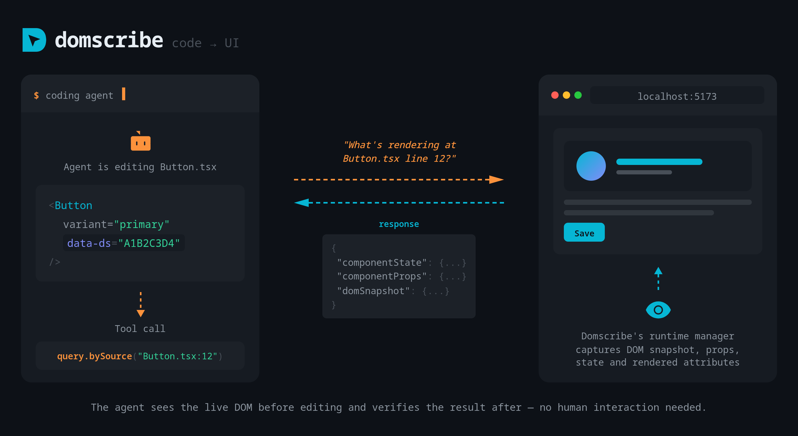
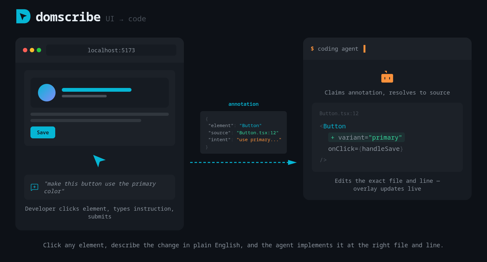
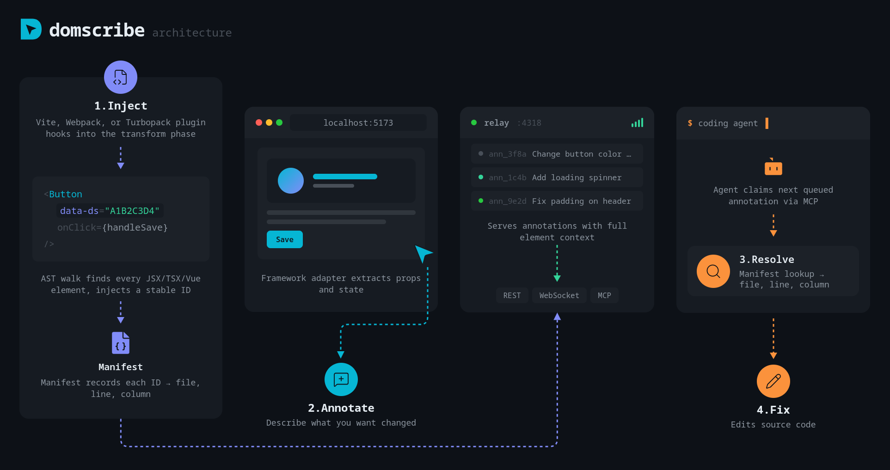

<p align="center">
  
</p>

<h1 align="center">Domscribe</h1>

<p align="center">
  <a href="https://www.npmjs.com/search?q=%40domscribe"></a>
  <a href="https://github.com/patchorbit/domscribe/actions"></a>
  <a href="#"></a>
  <a href="./LICENSE"></a>
  
  = 18" />
  <a href="https://github.com/patchorbit/domscribe/pulls"></a>
</p>

<p align="center">
  <a href="https://www.npmjs.com/package/@domscribe/react"></a>
  <a href="https://www.npmjs.com/package/@domscribe/vue"></a>
  <a href="https://www.npmjs.com/package/@domscribe/next"></a>
  <a href="https://www.npmjs.com/package/@domscribe/nuxt"></a>
  &nbsp;&nbsp;
  <a href="https://www.npmjs.com/package/@domscribe/transform"></a>
  <a href="https://www.npmjs.com/package/@domscribe/transform"></a>
  <a href="https://www.npmjs.com/package/@domscribe/transform"></a>
</p>

<p align="center">
  
  
  <a href="https://cursor.directory/plugins/domscribe"></a>
  
  
</p>

<p align="center">
  <a href="https://domscribe.com"></a>
</p>

---

**AI coding agents edit your source files blind — they can't see your running frontend, and your frontend can't tell them where to look.**

Domscribe bridges both directions: click a DOM element to tell your agent what to change, or let your agent query any source location to see exactly what it looks like live in the browser. Build-time stable IDs, deep runtime context (props, state, DOM), framework-agnostic, any MCP-compatible agent. Zero production impact.

---

## Getting Started

```bash
npx domscribe init
```

The setup wizard walks you through two steps:

1. **Connect your coding agent** — select your agent (Claude Code, Copilot, Gemini, Kiro, or others) and the wizard installs the plugin automatically.
2. **Add to your app** — select your framework and bundler, the wizard installs the right package and shows you the config snippet to add.

That's it. Start your dev server and you're ready to go.

> Prefer to set things up manually, or need finer control? See the [manual setup](#manual-setup) instructions below.

---

## Features

### Code → UI: Let the agent see the browser

Your agent calls `domscribe.query.bySource` with a file path and line number and gets back the live DOM snapshot, current props, component state, and rendered attributes — directly from the running browser. No human interaction needed.

<p align="center">
  
</p>

> [!TIP]
> Agents don't spontaneously query runtime state — prompt them explicitly:
> _"Fix the button color — use domscribe to check what CSS classes it has before changing anything."_
> Your dev server must be running with the target page open in the browser.

### UI → Code: Point and tell

Click any element in the browser overlay, describe the change in plain English, and submit. Domscribe captures the element's source location, runtime context, and your instruction as an annotation. The agent claims it, navigates to the exact file and line, and implements the change. The overlay shows the agent's response in real time via WebSocket.

<p align="center">
  
</p>

### More

- 🎯 **Build-time stable IDs** — deterministic `data-ds` attributes injected via AST, stable across HMR and fast refresh
- 🧩 **Framework-agnostic** — React 18-19, Vue 3, Next.js 15-16, Nuxt 3+, with an [extensible adapter interface](./packages/domscribe-runtime/CUSTOM_ADAPTERS.md)
- 📦 **Any bundler** — Vite 5-7, Webpack 5, Turbopack
- 🔍 **Deep runtime capture** — live props, state, and DOM snapshots via React fiber walking and Vue VNode inspection
- 🛡️ **Zero production impact** — all instrumentation stripped in production builds, enforced in CI
- 🔒 **PII redaction** — emails, tokens, and sensitive patterns automatically scrubbed before leaving the browser
- 📁 **Annotations live in your repo** — stored as JSON files in `.domscribe/annotations/`, exposed via REST APIs that MCP wraps for agent access
- 📡 **Real-time feedback** — WebSocket relay pushes agent responses to the browser overlay as they happen

---

## Manual Setup

> [!NOTE]
> `npx domscribe init` handles both steps below automatically. Use manual setup only if you need finer control.

Domscribe has two sides: **app-side** (bundler + framework plugins) and **agent-side** (MCP for your coding agent). Both are needed for the full workflow.

### App-Side — Add to Your Bundler

<details>
<summary><strong>Next.js (15 + 16)</strong> — <code>npm install -D @domscribe/next</code></summary>

```ts
// next.config.ts
import type { NextConfig } from 'next';
import { withDomscribe } from '@domscribe/next';

const nextConfig: NextConfig = {};

export default withDomscribe()(nextConfig);
```

</details>

<details>
<summary><strong>Nuxt 3+</strong> — <code>npm install -D @domscribe/nuxt</code></summary>

```ts
// nuxt.config.ts
export default defineNuxtConfig({
  modules: ['@domscribe/nuxt'],
});
```

</details>

<details>
<summary><strong>React 18–19</strong> — <code>npm install -D @domscribe/react</code></summary>

Vite plugin:

```ts
// vite.config.ts
import { defineConfig } from 'vite';
import react from '@vitejs/plugin-react';
import { domscribe } from '@domscribe/react/vite';

export default defineConfig({
  plugins: [react(), domscribe()],
});
```

Webpack plugin:

```js
// webpack.config.js
const { DomscribeWebpackPlugin } = require('@domscribe/react/webpack');

const isDevelopment = process.env.NODE_ENV !== 'production';

module.exports = {
  module: {
    rules: [
      {
        test: /\.[jt]sx?$/,
        exclude: /node_modules/,
        enforce: 'pre',
        use: [
          {
            loader: '@domscribe/transform/webpack-loader',
            options: { enabled: isDevelopment },
          },
        ],
      },
    ],
  },
  plugins: [
    new DomscribeWebpackPlugin({
      enabled: isDevelopment,
      overlay: true,
    }),
  ],
};
```

</details>

<details>
<summary><strong>Vue 3+</strong> — <code>npm install -D @domscribe/vue</code></summary>

Vite plugin:

```ts
// vite.config.ts
import { defineConfig } from 'vite';
import vue from '@vitejs/plugin-vue';
import { domscribe } from '@domscribe/vue/vite';

export default defineConfig({
  plugins: [vue(), domscribe()],
});
```

Webpack plugin:

```js
// webpack.config.js
const { DomscribeWebpackPlugin } = require('@domscribe/vue/webpack');

const isDevelopment = process.env.NODE_ENV !== 'production';

module.exports = {
  module: {
    rules: [
      {
        test: /\.[jt]sx?$/,
        exclude: /node_modules/,
        enforce: 'pre',
        use: [
          {
            loader: '@domscribe/transform/webpack-loader',
            options: { enabled: isDevelopment },
          },
        ],
      },
    ],
  },
  plugins: [
    new DomscribeWebpackPlugin({
      enabled: isDevelopment,
      overlay: true,
    }),
  ],
};
```

</details>

<details>
<summary><strong>Any framework</strong> — <code>npm install -D @domscribe/transform</code> (DOM→source mapping only, no runtime capture)</summary>

Vite plugin:

```ts
// vite.config.ts
import { defineConfig } from 'vite';
import { domscribe } from '@domscribe/transform/plugins/vite';

export default defineConfig({
  plugins: [domscribe()],
});
```

Webpack plugin:

```js
// webpack.config.js
const {
  DomscribeWebpackPlugin,
} = require('@domscribe/transform/plugins/webpack');

const isDevelopment = process.env.NODE_ENV !== 'production';

module.exports = {
  module: {
    rules: [
      {
        test: /\.[jt]sx?$/,
        exclude: /node_modules/,
        enforce: 'pre',
        use: [
          {
            loader: '@domscribe/transform/webpack-loader',
            options: { enabled: isDevelopment },
          },
        ],
      },
    ],
  },
  plugins: [
    new DomscribeWebpackPlugin({
      enabled: isDevelopment,
      overlay: true,
    }),
  ],
};
```

</details>

> **Working examples:** See [`packages/domscribe-test-fixtures/fixtures/`](./packages/domscribe-test-fixtures/fixtures/) for complete app setups across every supported framework and bundler combination.

For plugin configuration options, see the [`@domscribe/transform` README](./packages/domscribe-transform/README.md).

#### Monorepos

If your frontend app is in a subdirectory (e.g. `apps/web`), pass `--app-root` during init:

```bash
npx domscribe init --app-root apps/web
```

Or run `npx domscribe init` and follow the prompts — the wizard asks if you're in a monorepo.

This creates a `domscribe.config.json` at your repo root that tells all Domscribe tools where your app lives. CLI commands (`serve`, `stop`, `status`) and agent MCP connections automatically resolve the app root from this config — no extra flags needed.

### Agent-Side — Connect Your Coding Agent

Domscribe exposes 12 tools and 4 prompts via MCP. Agent plugins bundle the MCP config and a skill file that teaches the agent how to use the tools effectively.

#### Claude Code

```shell
claude plugin marketplace add patchorbit/domscribe
claude plugin install domscribe@domscribe
```

#### GitHub Copilot

```bash
copilot plugin install patchorbit/domscribe
```

#### Gemini CLI

```bash
gemini extensions install https://github.com/patchorbit/domscribe
```

#### Amazon Kiro

Open the Powers panel → **Add power from GitHub** → enter `https://github.com/patchorbit/domscribe`.

#### Cursor

<a href="https://cursor.directory/plugins/domscribe"></a>

#### Any agent (Skills and MCP)

Install the Domscribe skills:

```sh
npx skills add patchorbit/domscribe
```

Then add this MCP config to your agent:

```json
{
  "mcpServers": {
    "domscribe": {
      "type": "stdio",
      "command": "npx",
      "args": ["-y", "@domscribe/mcp"]
    }
  }
}
```

---

## How It Works

<p align="center">
  
</p>

**1. Inject.** The bundler plugin parses each source file, injects HMR-stable `data-ds` IDs via xxhash64, and records each mapping in `.domscribe/manifest.jsonl`.

**2. Capture.** Framework adapters (React fiber walking, Vue VNode inspection) extract live props, state, and component metadata. The overlay UI lets you click any element and see its full context.

**3. Relay.** A localhost Fastify daemon connects the browser and your agent via REST, WebSocket, and MCP stdio. A file lock prevents duplicate instances across dev server restarts.

**4. Agent.** Your coding agent connects via MCP to **query by source** (see what any line looks like live) or **process annotations** (claim, implement, and respond to UI change requests).

---

## Comparison

| Feature               | Domscribe                                    | [Stagewise](https://github.com/stagewise-io/stagewise) | [DevInspector MCP](https://github.com/mcpc-tech/dev-inspector-mcp) | [React Grab](https://github.com/aidenybai/react-grab) | [Frontman](https://github.com/frontman-ai/frontman) |
| --------------------- | -------------------------------------------- | ------------------------------------------------------ | ------------------------------------------------------------------ | ----------------------------------------------------- | --------------------------------------------------- |
| Build-time stable IDs | ✅ `data-ds` via AST                         | ❌ Runtime (CDP)                                       | ❌ No stable IDs                                                   | ❌ `_debugSource`                                     | ❌ Runtime framework introspection                  |
| DOM→source manifest   | ✅ JSONL, append-only                        | ❌                                                     | ❌                                                                 | ❌                                                    | ❌                                                  |
| Code→live DOM query   | ✅ Agent queries source, gets live runtime   | ❌                                                     | ❌                                                                 | ❌                                                    | ❌                                                  |
| Runtime props/state   | ✅ Fiber + VNode walking                     | ⚠️ Shallow                                             | ⚠️ DOM-level + JS eval                                             | ❌ HTML + component names only                        | ⚠️ Props only (framework APIs)                      |
| Multi-framework       | ✅ React · Vue · Next.js · Nuxt · extensible | ⚠️ React only                                          | ✅ React + Vue + Svelte + Solid + Preact                           | ❌ React only                                         | ⚠️ Next.js + Astro + Vite                           |
| Multi-bundler         | ✅ Vite + Webpack + Turbopack                | ❌ N/A (Electron browser)                              | ✅ Vite + Webpack + Turbopack                                      | ❌ N/A                                                | ❌ Dev server middleware                            |
| MCP tools             | ✅ 12 tools + 4 prompts                      | ❌ Proprietary protocol (Karton)                       | ✅ 9 tools                                                         | ⚠️ Lightweight add-on                                 | ❌ Internal MCP only                                |
| Agent-agnostic        | ✅ Any MCP client                            | ❌ Bundled Electron agent                              | ✅                                                                 | ✅                                                    | ❌ Bundled Elixir agent                             |
| In-app element picker | ✅ Lit shadow DOM                            | ✅ Built-in browser selector                           | ✅ Inspector bar                                                   | ✅ Hover-to-capture                                   | ✅ Chat interface                                   |
| Source mapping        | ✅ Deterministic (AST IDs)                   | ⚠️ AI-inferred                                         | ⚠️ AST-injected (not stable)                                       | ⚠️ `_debugSource` (workaround needed)                 | ⚠️ Runtime framework introspection                  |
| License               | ✅ MIT                                       | ⚠️ AGPL                                                | ✅ MIT                                                             | ✅ MIT                                                | ⚠️ Apache + AGPL                                    |

No single competitor combines build-time stable IDs, deep runtime capture, bidirectional source↔DOM querying, and an MCP tool surface in a framework-agnostic way.

---

## MCP Tools

| Tool                                | Description                                                                             |
| ----------------------------------- | --------------------------------------------------------------------------------------- |
| `domscribe.query.bySource`          | Query a source file + line and get live runtime context (props, state, DOM snapshot)    |
| `domscribe.manifest.query`          | Find manifest entries by file path, component name, or element ID                       |
| `domscribe.manifest.stats`          | Manifest coverage statistics (entry count, file count, component count, cache hit rate) |
| `domscribe.resolve`                 | Resolve a `data-ds` element ID to its source location (file, line, col, component)      |
| `domscribe.resolve.batch`           | Resolve multiple element IDs in one call                                                |
| `domscribe.annotation.process`      | Atomically claim the next queued annotation (prevents concurrent agent conflicts)       |
| `domscribe.annotation.respond`      | Attach agent response and transition to `PROCESSED`                                     |
| `domscribe.annotation.updateStatus` | Manually transition annotation status                                                   |
| `domscribe.annotation.get`          | Retrieve annotation by ID                                                               |
| `domscribe.annotation.list`         | List annotations with status/filter options                                             |
| `domscribe.annotation.search`       | Full-text search across annotation content                                              |
| `domscribe.status`                  | Relay daemon health, manifest stats, queue counts                                       |

See the [`@domscribe/mcp` README](./packages/domscribe-mcp/README.md) for detailed tool schemas, response formats, and prompt definitions.

---

## Packages

| Package                    | Description                                                                         |
| -------------------------- | ----------------------------------------------------------------------------------- |
| `@domscribe/core`          | Zod schemas, RFC 7807 error system, ID generation, PII redaction, constants         |
| `@domscribe/manifest`      | Append-only JSONL manifest, IDStabilizer (xxhash64), BatchWriter, ManifestCompactor |
| `@domscribe/relay`         | Fastify HTTP/WS server, MCP stdio adapter, annotation lifecycle                     |
| `@domscribe/transform`     | Parser-agnostic AST injection (Acorn, Babel, VueSFC), bundler plugins               |
| `@domscribe/runtime`       | Browser-side ElementTracker, ContextCapturer, BridgeDispatch                        |
| `@domscribe/overlay`       | Lit web components (shadow DOM), element picker, annotation UI                      |
| `@domscribe/react`         | React fiber walking, props/state extraction, Vite + Webpack plugins                 |
| `@domscribe/vue`           | Vue 3 VNode resolution, Composition + Options API support, Vite + Webpack plugins   |
| `@domscribe/next`          | `withDomscribe()` config wrapper for Next.js 15 + 16                                |
| `@domscribe/nuxt`          | Nuxt 3+ module with auto-relay and runtime plugin                                   |
| `domscribe`                | CLI binary (`domscribe serve`, `status`, `stop`, `init`, `mcp`)                     |
| `@domscribe/mcp`           | Standalone MCP server binary (`domscribe-mcp`)                                      |
| `@domscribe/test-fixtures` | Black-box integration + e2e suite (not published)                                   |

---

## Contributing

```bash
pnpm install
nx run-many -t build test lint typecheck
```

Conventions are in `.claude/rules/`. PRs welcome.

---

## License

[MIT](./LICENSE)
